<h1>Setup SIEM for Sentinel</h1>


<h2>Description</h2>
This project consist of me setting a basic home lab running Active Directory with Oracle VirtualBox and adding users with PowerShell.
<br />


<h2>Languages, Utilities, Enviorments </h2>

- <b>PowerShell</b> 
- <b>Azure subscription </b>
- <b>Windows 10 ISO</b>
- <b>


<h2>Lab walk-through:</h2>

<p align="center">
Create Virtual Machine: <br/>
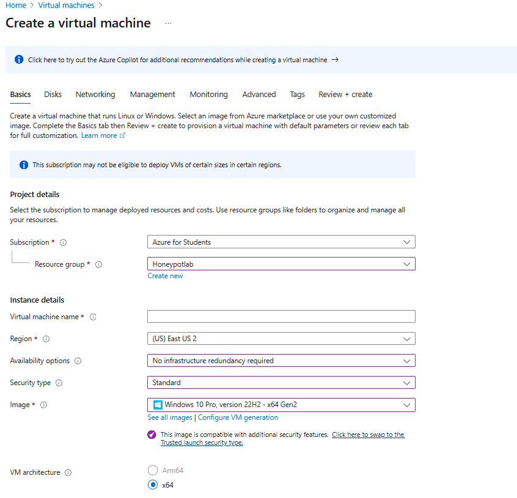
<br />
<br />
Create Log Analytics Workspace:  <br/>
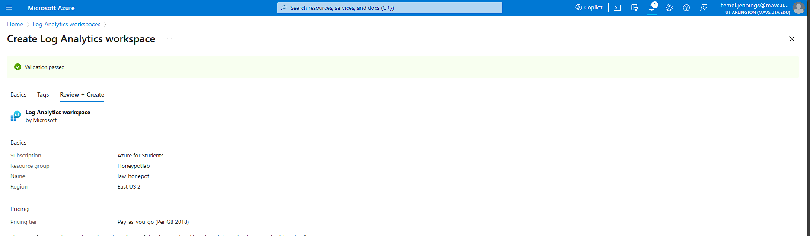
<br />
<br />
Enable server settings and data gathering in Microsoft Cloud Defender: <br/>
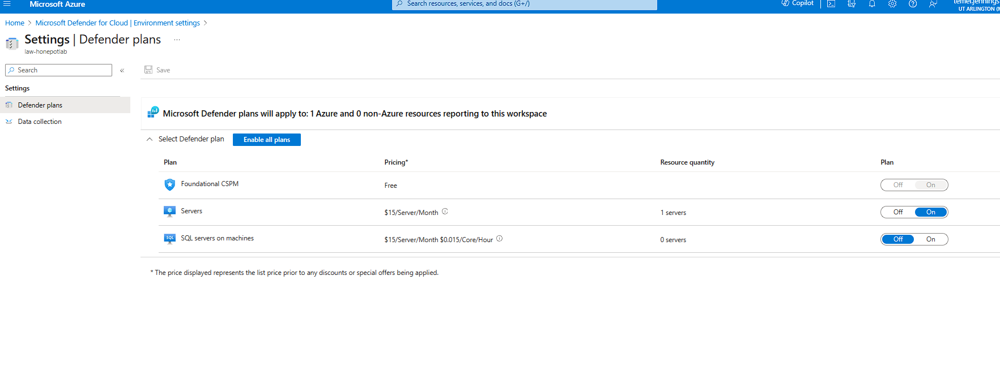
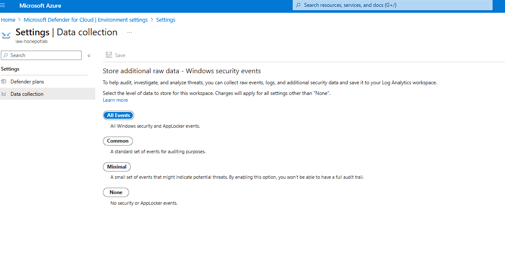
<br />
<br />
Connect Log Analytics to VM:  <br/>
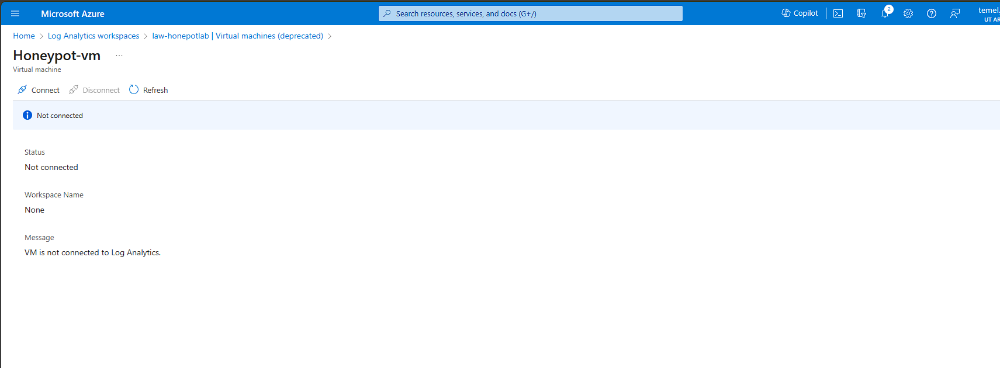
<br />
<br />
Setup Microsoft Sentinel:  <br/>
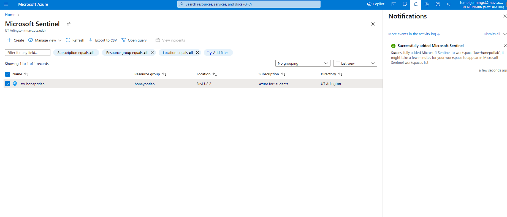
<br />
<br />
Observer Event Viewer Logs in VM: <br/>
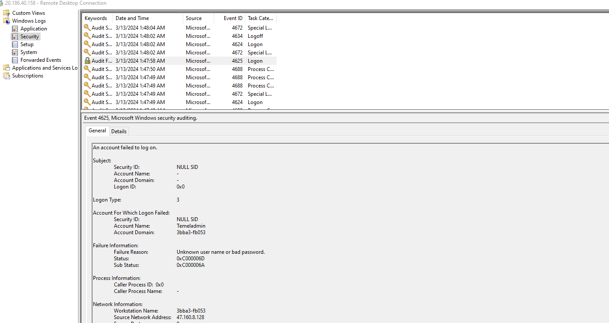
<br />
<br />
Turn off firewall and Ping VM from your machine:  <br/>
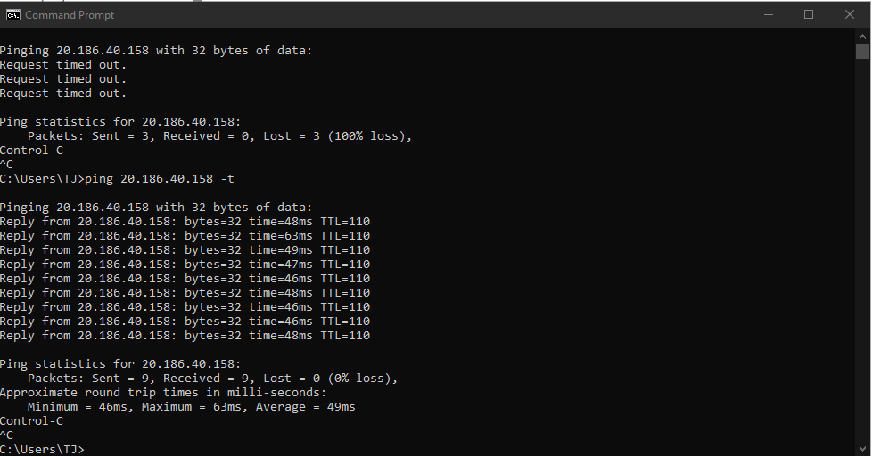
<br />
<br />
Download PowerShell script:  <br/>

<br />
<br />
Get Geolocation.io API Key:  <br/>

<br />
<br />
Run Script To get Geo Data from attackers across the globe:  <br/>
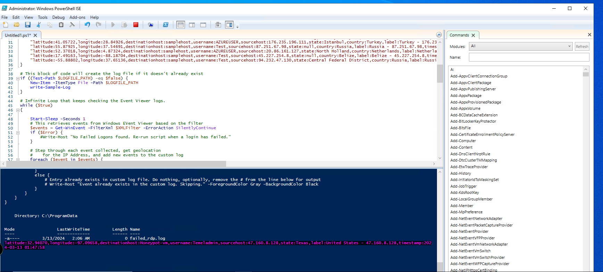
<br/>
<br/>
Failed Logon attempted logged: <br/>
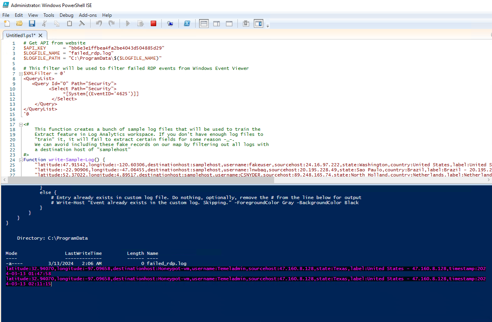
<br />
<br />
Bruteforce attacks being logged: <br/>
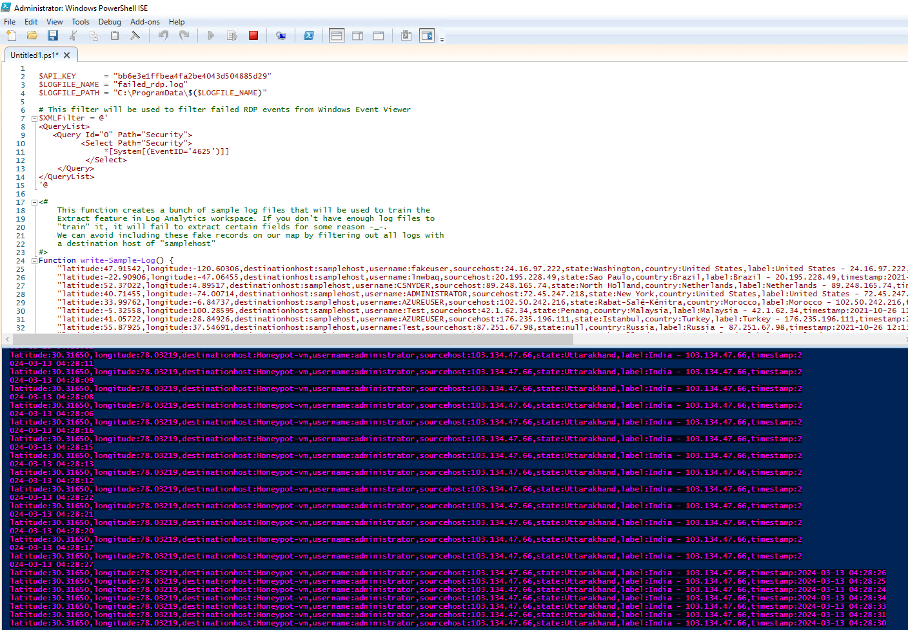
<br />
<br />
Create custom log in Log Analytics Workspace (LAW) to import in our custom log:  <br/>
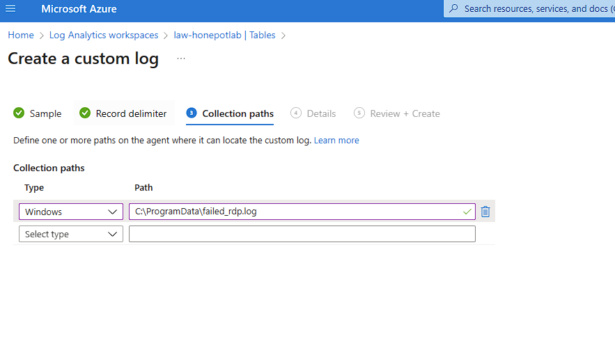
<br />
<br />
Extract fields from raw custom log data with custom script:  <br/>
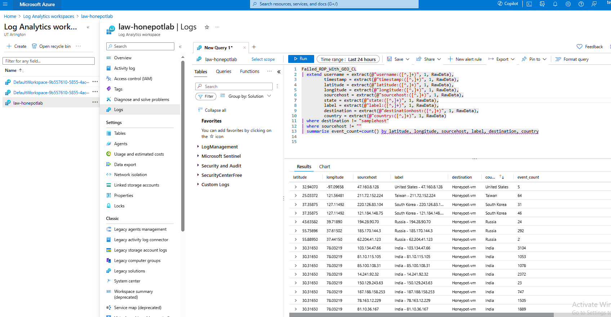
<br />
<br />
Setup map in Sentinel and connect to workspace:  <br/>

<br />
<br />
Run custom script in Sentinel workbooks and plot map:  <br/>
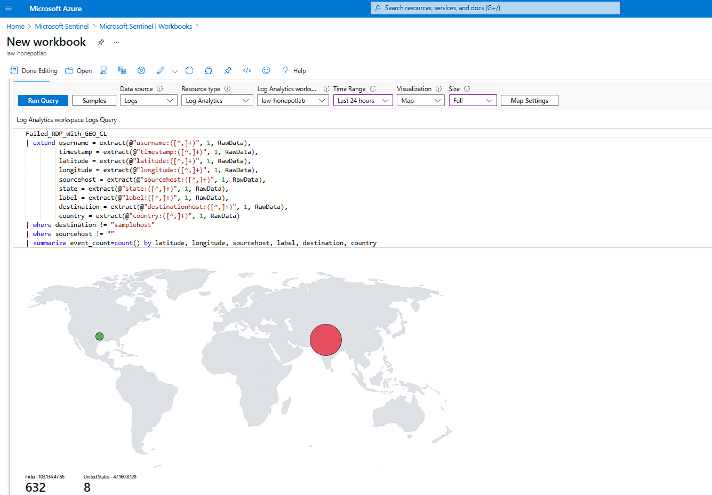
<br />
<br />
View map in Sentinel:  <br/>
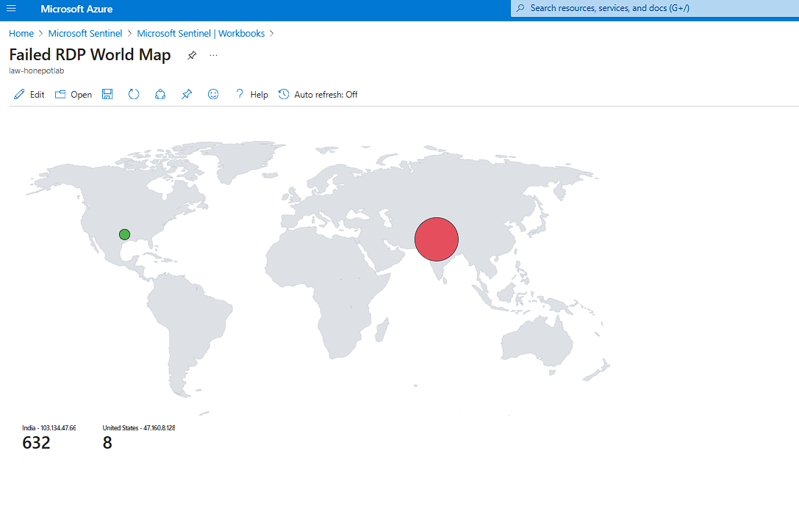
<br />
<br />
Final check on the map  <br/>
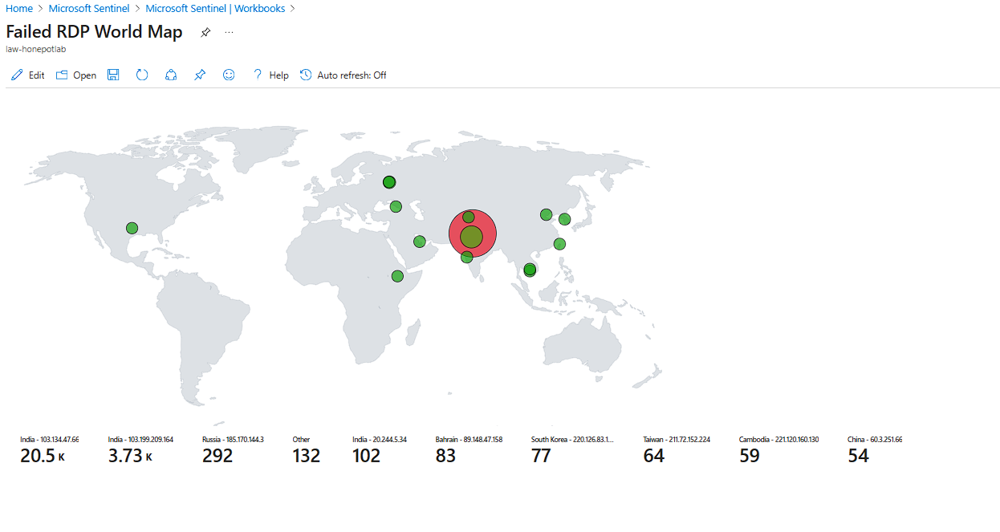
<br />
<br />
</p>

<!--
 ```diff
- text in red
+ text in green
! text in orange
# text in gray
@@ text in purple (and bold)@@
```
--!>
