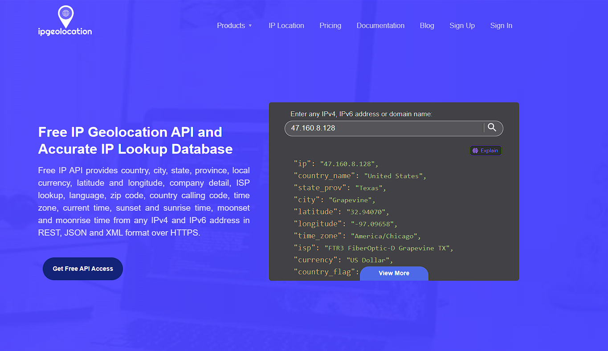

<h1>Setup SIEM for Sentinel</h1>


<h2>Description</h2>
In this project, I setup Microsoft Sentinel (SIEM) and connect it to a live virtual machine acting as a honey pot. I observe brute force attacks in real-time from across the globe. I used a custom PowerShell script to find the attackers Geo Data information and plot it on the Microsoft Sentinel Map.
<br />


<h2>Languages, Utilities, Enviorments </h2>

- <b>PowerShell</b> 
- <b>Azure subscription </b>
- <b>Windows 10 ISO</b>


<h2>Lab walk-through:</h2>

<p align="center">
Create Virtual Machine: <br/>

</p>
-  Created a resource group named honepotlab
<br />
-  Named the virtual machine
<br />
-  Selected Windows 10 as the Image
<br />
<br />
<br />
<br />
<p align="center">
Create Log Analytics Workspace: <br/>

</p>
<b></b>
<br />
<br />
<p align="center">
Enable server settings and data gathering in Microsoft Cloud Defender: <br/>


<p/>
<br />
<br />
<p align="center">
Connect Log Analytics to VM: <br/>

<br />
<br />
</p>
<br />
<p align="center">
Setup Microsoft Sentinel: <br/>

<br />
</p>
- <b> Added Sentinel (SIEM) to workspace in able to visualize attack data </b>
<br />
<br />
<p align="center">
Connect to VM with Remote Desktop: <br/>

<br />
<br />
</p>
<br />
<p align="center">
Observed Event Viewer Logs in VM: <br/>

</p>
<br />
- Focused on event 4625 for for failed account logons (brute-force) attacks
<br />
<br />
<p align="center">
Turn off firewall and Ping VM from my home machine: <br/>

</p>
<br />
- Turned off honeyport firewall to receive ICMP echo request
<br />
<br />
<p align="center">
Get Geolocation.io API Key: <br/>

</p>
-Used this site to get an API key to lookup attackers geodata
<br />
-Latitude, longitude, State, Country, Ip address, etc
<br />
<br />
<p align="center">
Run Script To get Geo Data from attackers across the globe: <br/>

</p>
-Used a custom PowerShell script to log event viewer security logs of failed logon attemps.
<br />
-Script takes log attemps geo data and creates a log file which was used to train my analytics workspace.
<br />
<br />
<br />
<p align="center">
Failed Logon attempted logged: <br/>

</p>
-Here I purposely failed to loggon to test the script
<br />
<br />
<br />
<p align="center">
Bruteforce attacks being logged: <br/>

</p>
-After some time attemps were being made
<br />
<br />
<br />
<p align="center">
Created custom log in Log Analytics Workspace (LAW) to import in our custom log: <br/>


</p>
- The custom powershell script created a txt file that I needed to import in LAW
<br/>
<br/>
<p align="center">

</p>
-The original path for log file in ProgramData folder
<br />
<br />
<p align="center">
Extract fields from raw custom log data with custom script: <br/>

</p>
-Used a custom  Kql/Sql script to extract the raw data needed to create custom fields for queries
<br />
<br />
<p align="center">
Setup map in Sentinel and connect to workspace: <br/>

<br />
<br />
Run custom script in Sentinel workbooks and plot map: <br/>

</p>
<br />
- I ran the same custom script in my Microsoft Sentinel to query the extracted fields and create a visual map of the brute force attacks
<br />
<br />
<p align="center">
View map in Sentinel: <br/>

<br />
<br />
Final check on the map <br/>

</p>
- I let the SIEM run until the next morning and checked on the map for a final time.
<br />
<br />

<!--
 ```diff
- text in red
+ text in green
! text in orange
# text in gray
@@ text in purple (and bold)@@
```
--!>
